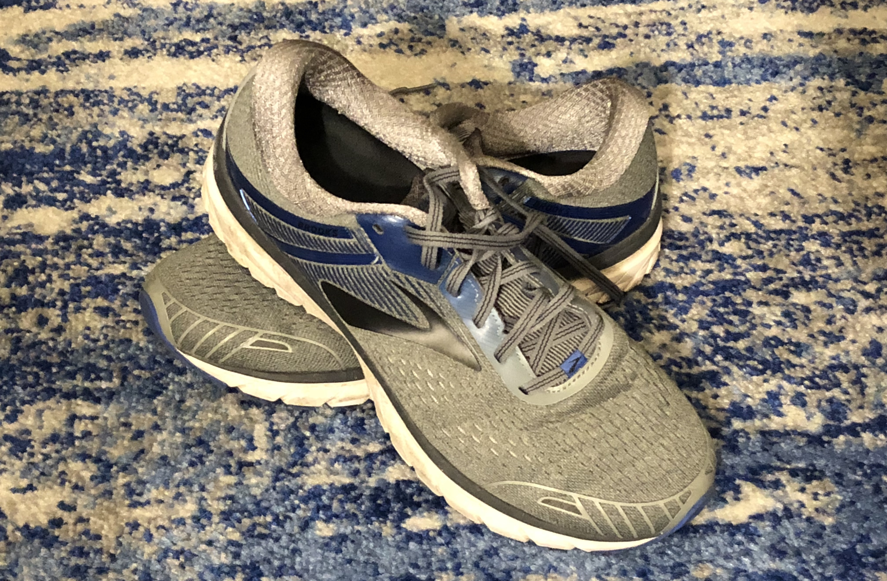
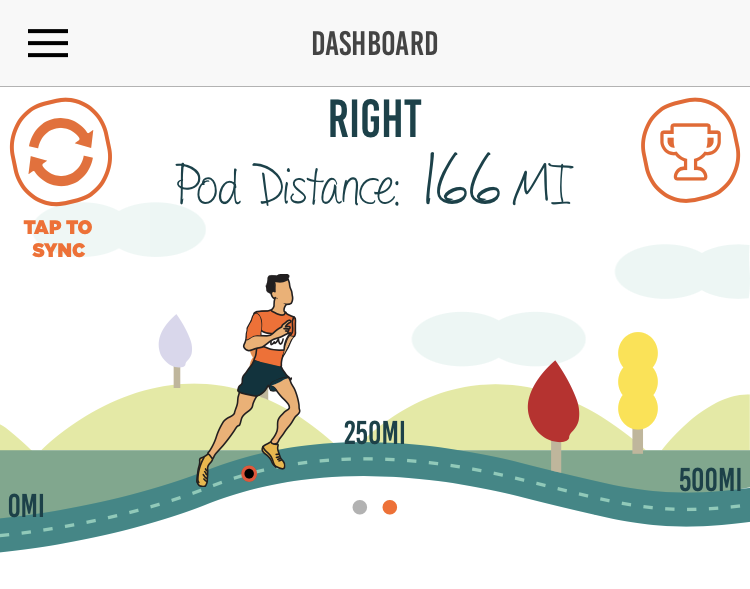

As far as I'm concerned, the most important piece of gear for running is your shoes. You're going to beat the hell out of your feet. Make sure you take care of them! I am currently rocking these Brooks shoes, and they've been through five half marathons and countless other training runs.

From my first trip to the running store up until last year I was always running in Asics (usually the Cumulus model) because I have wide feet and they were the most comfortable for me. But, last year's model started giving me problems. It turns out that the Cumulus line started getting thinner for some reason, and was no longer a good fit for me. I switched to Brooks, and I haven't looked back.

> If you have trouble with blisters, also consider wearing [Wright Socks](https://www.wrightsock.com/). I switched to them and have barely had blisters since. Science rules!

I picked up a pair of [Adrenaline GTS 18](https://www.brooksrunning.com/en_us/brooks-adrenaline-gts-18-mens-running-shoes/110271.html) shoes. I did initially make a mistake (since I'd been told that Brooks are wider shoes normally) not to get the wide model right away, assuming they'd be wide enough. It actually felt fine when I tried them out at the store, and even for a few runs after that. But eventually running in them started causing blisters. No thanks! I went back and got a pair of the wide version and those fit much better.

Brooks are pretty cushy and support my feet well. If you're more into natural/barefoot running, you'll probably hate them. I've put almost 170 miles on mine and they've held up great.

> I only use running shoes for running, specifically because I want to know how many miles I put on them so I can replace them when it's time. 

The screenshot above is from the [Zwift RunPod](https://zwift.com/shop/product/zwift-runpod) (previously known as the Milestone Pod). I use to track various running stats, but it also tracks the mileage you put on your shoes. It's not 100% accurate, but it's close enough. The general rule seems to be to replace them around 500 miles. 
