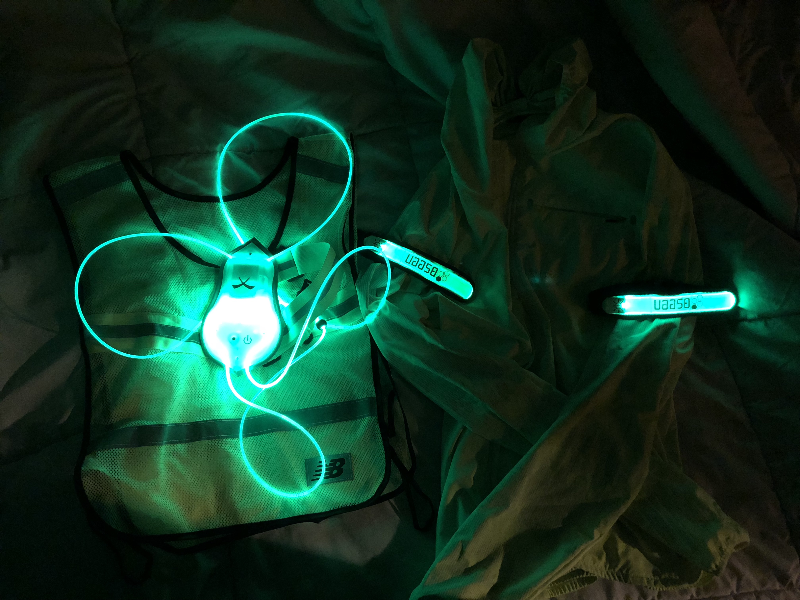
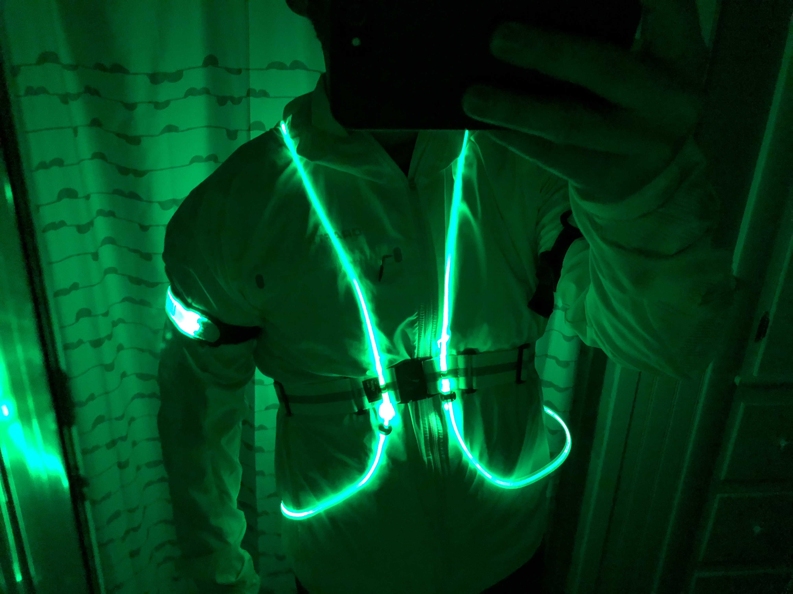

As a husband and father, safety is of the utmost importance to me when running, *especially* when I run in the dark, either early in the morning or at night. (If you didn't see the article on the [Road ID](/road-id) yet, then check that out also, as it's an essential safety/emergency item) 

I run with a local club on Thursdays after work, which in the fall and winter means running in the dark. The majority of us wear at least reflective gear, and many of us have light up safety gear to keep drivers alert to our presence on the roads. I try to stay on sidewalks when possible, but sometimes they're impassable or a mess and you end up running in the road. It's going to happen. I run against the flow of traffic (usually) so I can see cars coming, and I wear reflective material and lights when running at night. I do **not** want to spend any time in the hospital!

My favorite piece of light-up gear right now is my new [Tracer360 illuminated vest](https://www.noxgear.com/tracer360). It's bright as hell, light, keeps out of the way, and you can customize the color/blinking pattern. It *really* gets peoples' attention. 

Prior to picking that up, I was just using these [Bseen light-up arm bands](https://www.amazon.com/gp/product/B017WGIDM6). They only do one color. You press it once for solid light, and twice for blinking. That did the trick for a while, really, but I feel like the Tracer360 is a much better option.

In the past I picked up a generic running reflector vest. I don't like it. It feels weird and gets in the way. But, one thing I picked up in the fall that I do like a lot is this [Craft urban running jacket](https://www.craftsportswear.com/B2C%20-%20Craft/all-products-7a58fca3/clothes/jackets--vests/1906447-809926/) which is bright, has reflector material on the sleeves, is wind/water repellant, and is light as hell. It has nice pockets and a hood also. I don't feel like it slows me down at all. It's also nice in the cold. It's thin, but I can run comfortably in temps down to 30°F in this with just a compression shirt on underneath. (I warm up pretty quickly once I start running)

Hey, I'll even try all this stuff on so you can see it in action!

Does it look silly? Maybe. Do I care? Not a damn bit! If you care too much about what you look like, to the point that you're willing to risk your safety by *not* wearing gear like this, well, that's your call. Best of luck to you, and I hope you don't get hit by a car. 
