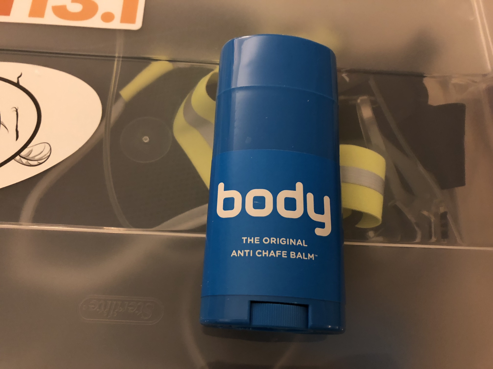

##Protect yourself in other ways, too...

Chafing is *the worst*. Obviously, you're going to be moving a lot when running. Things are gonna rub together. Apply some [Body Glide](https://www.bodyglide.com) in those sensitive areas and you're going to be much more comfortable. 

Oh, and it's got use in other areas as well. At some point, you will encounter the dreaded [bloody nipples](https://www.runnersworld.com/beginner/a20846387/how-can-i-prevent-bloody-nipples/) and guess what? Body Glide works wonders for that also. 

But that's not all! It also helps you avoid blisters if you rub a little on the areas of your toes where that tends to happen. (I have a minor case of [hammer toe](https://www.superfeet.com/en-us/news/hammer-toes-explained), so my two outer toes get a dose of this every time I run)

Happy Gliding!