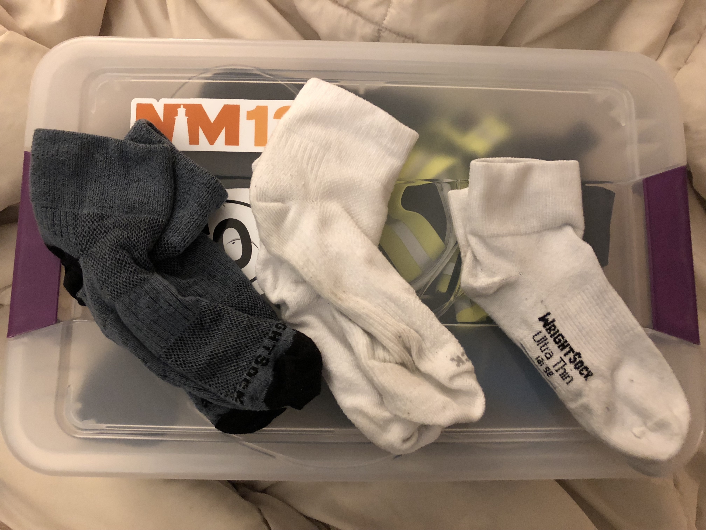

A runner-up to the unpleasantness that is chafing is blisters. One way to avoid them is to make sure that there's plenty of room for your toes in your shoes. Another way to help is to use [Body Glide](/body-glide) on your toes, as I went over in my last post. But last year I also found out about these particular socks that help to avoid blisters: [Wright Socks](https://www.wrightsock.com/)! 

Although their packaging "guarantees" no blisters, I have gotten a few small ones with them before. It depends on how much elevation you encounter, I think. But, I'll say this: since I started wearing them last year, I haven't had any large, nasty blisters again. I think I just had two small ones after one race. Not bad at all!

I don't know what kind of awesome science is going on here, and I don't really care. They definitely help me out, so now I never run without them. 

Oh, and they have a variety of socks, so I don't hike without them anymore now, either.
