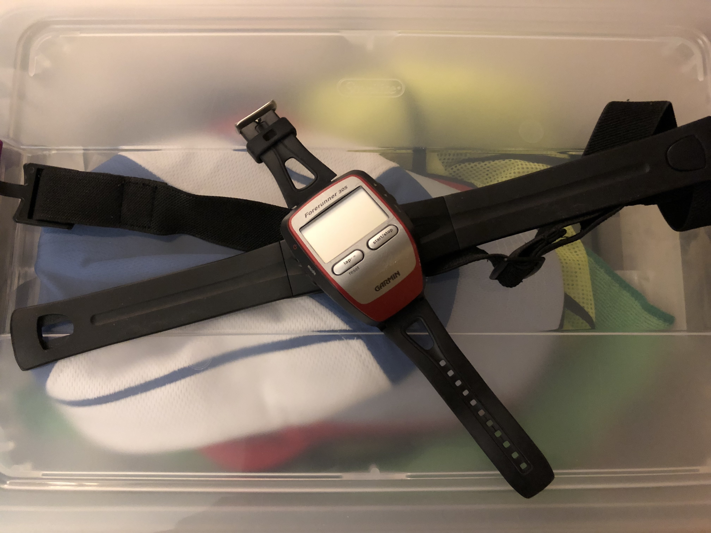
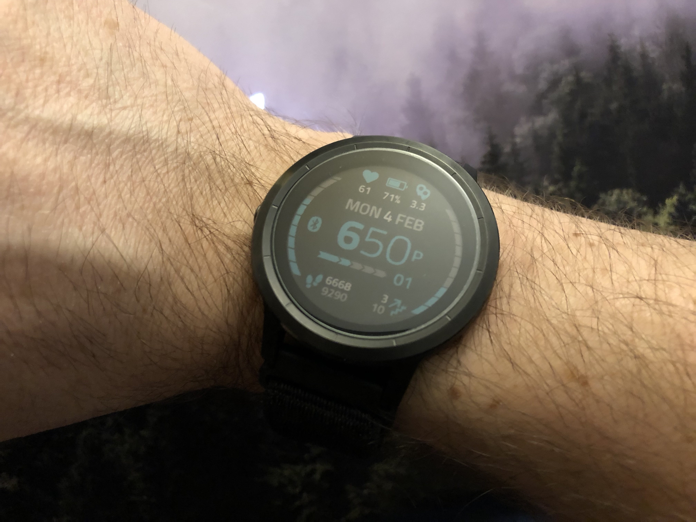

I've always used [Garmin](https://www.garmin.com) GPS devices. My first was this little yellow brick I could throw on my dashboard and connect via serial cable to my PowerBook G3, and then get driving directions from DeLorme's atlas software. Every phone does that nowadays, but back in 1999/2000 that was pretty damn awesome.

[When I started running](/how-i-became-a-runner) I looked at ways to track my activity and saw the Garmin GPS watches. I didn't hesitate to grab one: a Garmin Forerunner 305. I still have it, actually (and it still works!). This beast (along with a chest strap for heart rate monitoring and a footpod for cadence) got me through years of running:

Eventually the Nike Fuel Band, then Fitbit, etc. came along and started a trend in smaller, simpler devices. Garmin followed suit with their vivo line. I got a [Garmin Vivosmart](https://buy.garmin.com/en-US/US/p/154886) for every day use, and then followed it up with the [Vivosmart HR](https://buy.garmin.com/en-US/US/p/531166). But, I was still switching to my Forerunner when running/cycling/etc., because these didn't track GPS, etc. 

Then came the [Vivosmart HR+](https://buy.garmin.com/en-US/US/p/548743) which finally packed in GPS into a small wrist watch. Once I got that, I put away the Forerunner for good. I now had one watch that met all of my needs. They weren't perfect, though. The touchscreen would activate in water, you couldn't replace the wrist band, and the rubber strap occasionally gave me heat blisters on my wrists. 

Their next level watches in the Vivoactive line improved things by working with standard watch straps. They also were trying to compete more directly with the Apple Watch, so they shoved more features into them. I didn't like the first couple of Vivoactive models, but the [Vivoactive 3](https://buy.garmin.com/en-US/US/p/571520) finally looked and felt like a normal watch, so I grabbed one of those and in my opinion, this piece is perfection. 

**Pros:**
- Battery life (I go days without charging, even with daily activities)
- Quick GPS acquisition (I don't have to stand around as long as I did with the Vivosmart HR+/Forerunner 305)
- Supports custom training workouts (I have the 8x400m, etc. programmed into mine)
- vo2max monitoring (approximate)
- Works for every activity I do

**Cons:**
- I actually dislike the touch swipe feature on the side. It makes it too easy to accidentally change things mid-workout, especially when doing things where my wrist is at an angle, like push-ups.
- Stock strap. I hate rubber. I replaced mine with [this strap](https://www.amazon.com/gp/product/B07D6ZPCKR) I got on amazon because it's easy to get on/off, breathable, stretchy, and still looks ok.
- I don't love the strength training mode. It tries to get you to use it to track reps, etc., which I can understand because it was to differentiate between active & rest time, but I track that stuff in Strava anyway, so I kinda wish it still had a more generic strength training mode like it used to. Instead, I record my workout in Cardio mode and change the activity type in Connect afterwards.

I'll also note that I've had two of these. I originally had one with the silver rim, but I got a really good deal on a gray one and returned the other. The rim scratches much less.

I also picked up some of these [screen protectors](https://www.amazon.com/gp/product/B0775YTLB1) which have already saved me once when I accidentally hit a wall. 

If you're looking for something to replace an Apple Watch, then you might consider the [Vivoactive 3 Music](https://buy.garmin.com/en-US/US/p/602068) or the new model they announced at CES last year with [LTE cellular data](https://www.digitaltrends.com/smartwatch-reviews/garmin-vivoactive-3-music-4g-lte-verizon-review-ces-2019/). I always have my phone on me when running, so it didn't seem necessary to have those features.

##Conclusion
Garmins are right for me, but do your research. I've found that some stores, like Best Buy, REI, etc. usually have a handful of these types of devices on display so you can size them up / try them on in person.