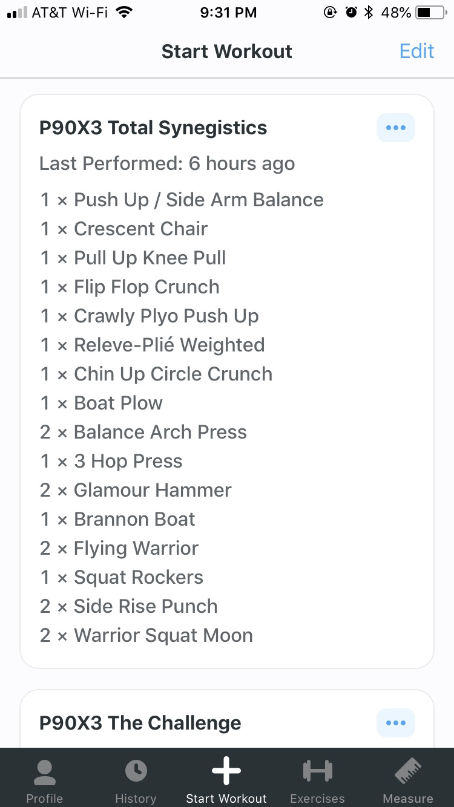

In my [post about marathon training](/training_for_my_first_marathon) I talked about mixing [P90X3](https://www.beachbody.com/product/fitness_programs/p90x3-workout.do) workouts into my training plan. I also mentioned tracking my workouts. I track my results in the strength training workouts from P90X3 so I can see my progress. Historically, I have done this by printing out their worksheets and filling those in. I hate printing things, though, and if I'm travelling, I do not want to be worrying about bringing along paperwork in addition to my workout gear.

In many of the workout videos from P90X3, Tony Horton mentions a P90X app for mobile devices. After looking for it, I discovered that it no longer exists. I don't know why, but they either pulled it from the app stores, or they stopped paying the fees for their Apple developer account and their apps were pulled as a result. Either way, poof. It's gone.

I never got to use Beach Body's app, but I have found a suitable replacement in [Strong](https://www.strong.app). A lot of fellow software developers, whom I also correspond with about fitness and training, use Strong to track their workouts (mostly lifting). You can create custom workouts and exercises, so it was perfect for my needs. I tried it out a few times and liked it so much I bought the lifetime license for it.

I spent a fair amount of time creating custom workouts in Strong for the P90X3 workouts I do. I hit a snag near the start where I realized if I just pull in the standard "pull up" exercise that the app comes with, and I do it in more than one workout, the values update across workouts. That's actually a problem for how the P90X3 system works, because some workouts share exercises, but you need to track them separately. So, I ended up creating custom exercises for each move in the P90X3 workouts, before I discovered that you can turn off in Profile -> Settings -> Bonus options by changing the "Previous set" value to "Same routine only".

So, if you'd like to use Strong and P90X3, then feel free to utilize the custom workouts I created. You should open these links on your mobile device with Strong already installed.

- [P90X3 Incinerator](https://strong.app.link/vRwp89nz4T)
- [P90X3 Eccentric Lower](https://strong.app.link/L6bau1oz4T)
- [P90X3 Eccentric Upper](https://strong.app.link/lGyHKXbJ4T)
- [P90X3 Total Synergistics](https://strong.app.link/Tz830vgJ4T)
- [P90X3 The Challenge](https://strong.app.link/rw2ndelJ4T)
