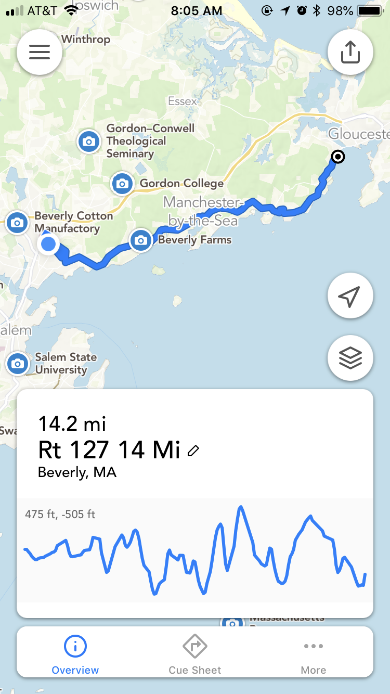

Do you ever get sick of doing the same run over and over again? I do. Variety is the spice of life, after all. 

To help with that, I've always used some kind of software to help me find a running route that meets the distance/elevation requirements I'm looking for, and that isn't going to be boring. A long time ago I started using [gmap-pedometer.com](https://www.gmap-pedometer.com), which is now called Miler Meter. It was initially only a website that used Google Maps to let you click waypoints and create a route. It would give you distance and elevation info, and let you save routes. Very handy! There is now also a mobile app version of it.

But, there's also a lot of other competitor products now. I have since switched to [Footpath](https://footpathapp.com) and it's so much better. I can just pop open a map and draw with my finger and it turns it into a street route. I've been using this for a few months now and purchased it so I could save all my routes. If you're interested in finding new routes, I'd recommend giving this app a try. It's the easiest way to quickly sketch out a route.

