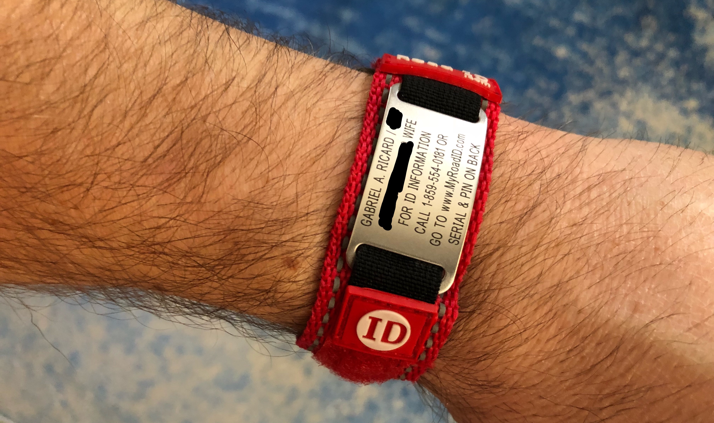

Thankfully, I haven't had any accidents while running (yet). However, I have friends who have had accidents while cycling. After one friend had his first cycling accident (being hit by a car) he purchased a [Road ID](https://www.roadid.com) bracelet, and after we had talked about it, I decided I should do the same. 

I'm on my second bracelet now. My wife and I both have them now, with each others' contact information on them. Our Road IDs also have information on them so that emergency personnel can look up our medical profiles and emergency contact information. We both go on long runs frequently, so it's good peace of mind to know that if something happens we can be contacted.

Also, they have a variety of tags available. You can get bracelets, or tags that attach to an watch wristband, or your shoe, etc. They even make them for pets!

I never run without mine, and I highly recommend you don't either.
